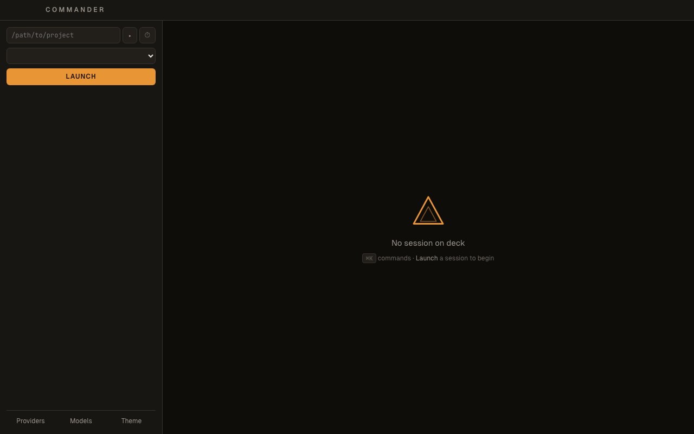
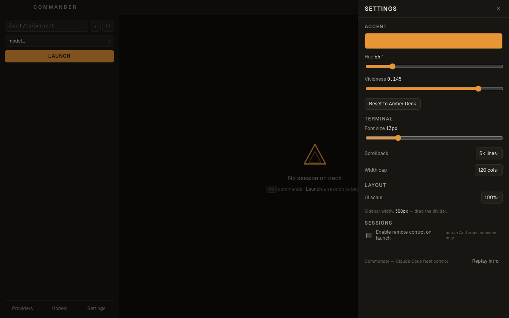

# Commander

**Claude Code fleet control.** A macOS command deck for running multiple
[Claude Code](https://code.claude.com) sessions across projects — each on a
different model, from Anthropic-native to OpenCode Zen to AWS Bedrock —
launched, watched, swapped, and resumed from one window.



## What it does

- **Launch** Claude Code into any project folder on any configured model.
  Sessions live in tmux windows: they survive the app closing, crashing, or
  your Mac sleeping.
- **Watch** live telemetry per session: context-window fill (green/amber/red
  bands), estimated $/turn, turn count, uptime. Finished sessions light up —
  readable from across the room.
- **Swap models mid-conversation.** Same conversation, new brain: Commander
  kills the window and relaunches `claude --resume` under the new model's
  environment. Anthropic ↔ open-weight ↔ Bedrock, in either direction.
- **Hand off to your phone.** One click enables Claude Code's Remote Control
  on a native session — scan the QR, keep the session running on your Mac,
  drive it from the Claude mobile app. Survives model swaps.
- **⌘K everything**: jump to sessions, relaunch recent projects, swap models,
  open config.

| Providers | How |
|---|---|
| **Anthropic** (subscription) | Native — no proxy, OAuth intact, Remote Control works |
| **OpenCode Zen/Go** (GLM, Kimi, DeepSeek, Qwen…) | Routed through a local [LiteLLM](https://github.com/BerriAI/litellm) proxy, started lazily |
| **AWS Bedrock** (Claude, Nova, Llama…) | Routed via LiteLLM with SigV4; one-click model discovery from your AWS account, tool-capable models flagged |

**Provider API keys live in the macOS keychain — never on disk.** Generated
LiteLLM configs reference keys as `os.environ/…` env vars, never values.

Security model, plainly: Commander runs a loopback-only HTTP server for the
terminal stream (`/ws`) and Claude Code's finish hook (`/notify`); both are
gated by a random per-run token (constant-time compared) and an Origin check.
Two per-run secrets do touch disk with `0600` perms: the hook token inside
`~/.claude/settings.json` (Commander installs a Stop hook there on startup,
removes it on shutdown) and the LiteLLM master key in its generated yaml —
both rotate every run and gate only loopback services.



## Requirements

- macOS (Apple Silicon primary)
- tmux ≥ 3.2 — `brew install tmux`
- The [`claude` CLI](https://code.claude.com/docs) — `npm install -g @anthropic-ai/claude-code`
- For routed models: `pip install 'litellm[proxy]'` (or set `COMMANDER_LITELLM`)
- For Remote Control: a claude.ai subscription plan that includes it
- To build: Go 1.24+, Node 20+, [Wails v2](https://wails.io) CLI
  (`go install github.com/wailsapp/wails/v2/cmd/wails@latest`)

## Install

**From a release** (if you've been handed one):

```bash
gh release download --repo halalgami/CodingAgentCommander -p "*.dmg"
# open the DMG, drag Commander to Applications, right-click → Open (first time)
```

**From source:**

```bash
git clone https://github.com/halalgami/CodingAgentCommander
cd CodingAgentCommander
make build          # → build/bin/commander-gui.app
make dev            # live-reload dev mode
```

First run: just launch — Commander seeds `~/.config/commander/config.toml`
with the native Anthropic models (zero keys needed on a subscription) and the
Models drawer grows it from there. Prefer curating by hand? Copy
`example.config.toml` there first instead.

## Quick tour

1. **Launch panel** — pick a folder (recents remembered), pick a model, LAUNCH.
2. **Session cards** — context meter, $/turn, model badge; hover for rename /
   kill (two-step confirm) / swap / 📱 remote control.
3. **Drawers** — Providers (keys → keychain), Models (add/remove, Bedrock
   discovery), Settings (accent color, terminal font/scrollback/width,
   UI scale, RC-on-launch).
4. **⌘K** — command palette. **⌘= / ⌘- / ⌘0** — terminal font size.

## Development

```bash
make test                            # Go suite
cd frontend
npx playwright install chromium      # once, downloads the test browser
npx playwright test                  # UI smokes
node --test src/lib/*.test.js src/lib/theme/*.test.js
```

Manual-verification guide: `docs/RUN_GUI.md`. Distribution notes:
`docs/BUNDLING_MACOS.md`.

## License

[MIT](LICENSE). Not affiliated with or endorsed by Anthropic. "Claude" and
"Claude Code" are trademarks of Anthropic, PBC.
