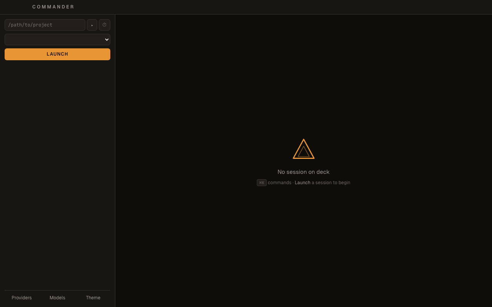
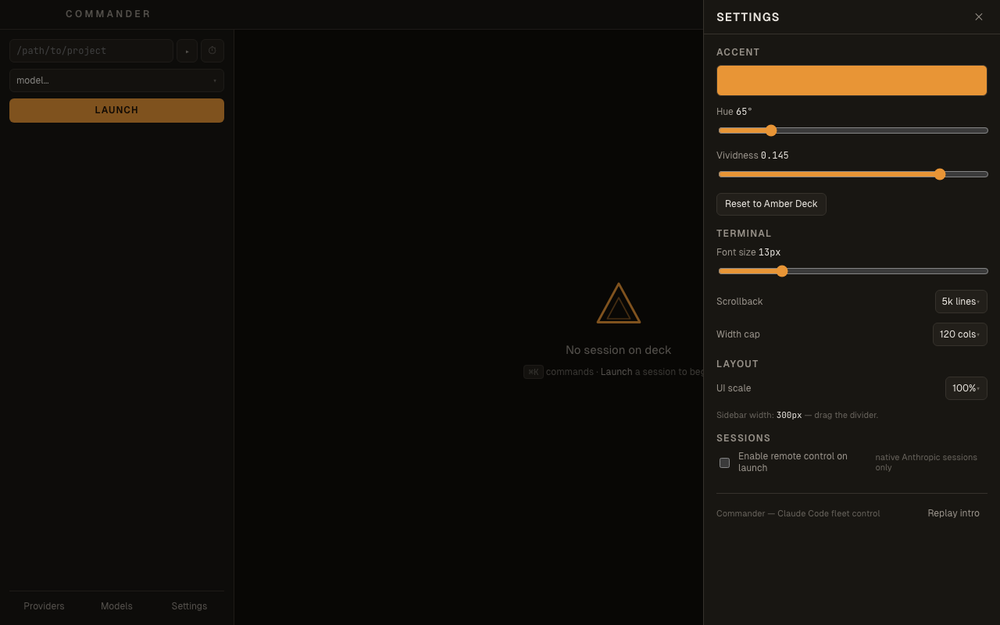

# Commander

**Claude Code fleet control.** A command deck for running multiple
[Claude Code](https://code.claude.com) sessions across projects — each on a
different model, from Anthropic-native to OpenCode Zen to AWS Bedrock —
launched, watched, swapped, and resumed from one window.

Runs natively on **macOS** (primary) and **Windows** (no WSL — sessions are
hosted by [psmux](https://github.com/psmux/psmux), a native tmux for Windows).



## What it does

- **Launch** Claude Code into any project folder on any configured model.
  Sessions live in tmux windows (psmux windows on Windows): they survive the
  app closing, crashing, or the machine sleeping.
- **Watch** live telemetry per session: context-window fill (green/amber/red
  bands), estimated $/turn, turn count, uptime. Finished sessions light up —
  readable from across the room.
- **Swap models mid-conversation.** Same conversation, new brain: Commander
  kills the window and relaunches `claude --resume` under the new model's
  environment. Anthropic ↔ open-weight ↔ Bedrock, in either direction.
- **Hand off to your phone.** One click enables Claude Code's Remote Control
  on a native session — scan the QR, keep the session running on your Mac,
  drive it from the Claude mobile app. Survives model swaps.
- **⌘K everything**: jump to sessions, relaunch recent projects, swap models,
  open config.

| Providers | How |
|---|---|
| **Anthropic** (subscription) | Native — no proxy, OAuth intact, Remote Control works |
| **OpenCode Zen/Go** (GLM, Kimi, DeepSeek, Qwen…) | Routed through a local [LiteLLM](https://github.com/BerriAI/litellm) proxy, started lazily |
| **AWS Bedrock** (Claude, Nova, Llama…) | Routed via LiteLLM with SigV4; one-click model discovery from your AWS account, tool-capable models flagged |

**Provider API keys live in the OS credential store — never on disk** (macOS
Keychain; Windows Credential Manager). Generated LiteLLM configs reference keys
as `os.environ/…` env vars, never values.

Security model, plainly: Commander runs a loopback-only HTTP server for the
terminal stream (`/ws`) and Claude Code's finish hook (`/notify`); both are
gated by a random per-run token (constant-time compared) and an Origin check.
Two per-run secrets do touch disk with `0600` perms: the hook token inside
`~/.claude/settings.json` (Commander installs a Stop hook there on startup,
removes it on shutdown) and the LiteLLM master key in its generated yaml —
both rotate every run and gate only loopback services.



## Requirements

Common to both platforms:

- The [`claude` CLI](https://code.claude.com/docs) — `npm install -g @anthropic-ai/claude-code`
- For routed models: the app builds a LiteLLM runtime on first use (launch a
  routed model → **Install** in the prompt; needs Python 3.10–3.13 + network
  once). To install it yourself, pin the tested pair — a floating
  `litellm[proxy]` pulls an incompatible FastAPI and the proxy won't boot:
  `python3.12 -m pip install --user 'litellm[proxy]==1.83.9' 'fastapi==0.124.4'`
  (or point `COMMANDER_LITELLM` at an existing litellm)
- For Remote Control: a claude.ai subscription plan that includes it
- To build: Go 1.25+, Node 20+, [Wails v2](https://wails.io) CLI
  (`go install github.com/wailsapp/wails/v2/cmd/wails@v2.13.0`)

**macOS** (Apple Silicon primary):

- tmux ≥ 3.2 — `brew install tmux`

**Windows** (10/11, x64 — no WSL required). The release exe brings its own
session host, so the only thing you must install yourself is the `claude` CLI
above:

- [psmux](https://github.com/psmux/psmux) — **bundled**. The release embeds
  psmux 3.3.8 (MIT) and extracts it to `%AppData%\Commander\bin` on first
  launch. psmux is a native tmux for Windows; the `tmux` shim it provides is the
  binary Commander actually calls. A psmux already on your `PATH` takes
  precedence over the bundled copy, so `winget install marlocarlo.psmux` (or
  scoop, choco, cargo) still works if you would rather manage it yourself.
- **PowerShell 7+** (`pwsh`) — **fetched on demand**. Not optional and not the
  same as the Windows PowerShell 5.1 that ships with Windows: psmux's Claude
  Code integration requires 7+. If it is missing, Commander offers a one-click
  download (~106 MB, verified against a checksum pinned in
  `internal/deps/pwsh_windows.go`) into `%AppData%\Commander\runtime`. To
  install it yourself instead: `winget install Microsoft.PowerShell`
- WebView2 runtime — the release embeds Microsoft's bootstrapper, so a machine
  without the runtime installs it rather than being sent to a browser
  mid-launch. Preinstalled on Windows 11 either way.

Nothing is written outside your user profile, and a missing dependency is named
in a startup panel with the command that fixes it — not surfaced as a failed
launch.

> **Why bundle psmux at all?** Because "installed" and "runnable" are different
> claims on Windows. A winget package whose `Links` shim was never recreated, or
> a scoop install whose shims directory is off `PATH`, leaves
> `exec: "tmux": executable file not found in %PATH%` while the package manager
> insists psmux is installed. Carrying the binary removes that failure mode for
> the one tool Commander cannot run without.

## Install

**From a release — macOS:**

```bash
gh release download --repo halalgami/CodingAgentCommander -p "*.dmg"
# open the DMG, drag Commander to Applications, right-click → Open (first time)
```

**From a release — Windows.** A single portable exe: no installer, no admin
rights, nothing written outside your user profile. Delete the file to uninstall.

```powershell
gh release download --repo halalgami/CodingAgentCommander -p "commander-gui.exe" -p "*.sha256"
```

Then verify it before you run it — the releases are built by GitHub Actions
precisely so that you can:

```powershell
# 1. Integrity — must match the published .sha256
(Get-FileHash .\commander-gui.exe -Algorithm SHA256).Hash.ToLower()

# 2. Provenance — proves GitHub built this exe from this repo's source
gh attestation verify .\commander-gui.exe --repo halalgami/CodingAgentCommander
```

Check 2 needs the [`gh` CLI](https://cli.github.com) **signed in**
(`gh auth login`) — it queries the attestations API, which the CLI will not do
anonymously. No account? The attestation itself is public, so you can fetch the
bundle and verify entirely offline:

```powershell
$d = (Get-FileHash .\commander-gui.exe -Algorithm SHA256).Hash.ToLower()
(Invoke-RestMethod "https://api.github.com/repos/halalgami/CodingAgentCommander/attestations/sha256:$d").attestations[0].bundle |
  ConvertTo-Json -Depth 30 -Compress | Set-Content att.jsonl -Encoding utf8
gh attestation verify .\commander-gui.exe --bundle att.jsonl --repo halalgami/CodingAgentCommander
```

The second check is the one that carries weight. A checksum only shows the file
arrived intact — whoever could replace the exe could replace the checksum next
to it. The attestation is signed by GitHub against the workflow run that
produced the binary, so it ties the file to a specific commit of this public
source tree.

> **SmartScreen will warn on first run.** The exe is not code-signed, so Windows
> shows *"Windows protected your PC"*. That is what Windows shows for any binary
> without a paid Authenticode certificate — it is not a signal that anything is
> wrong with this one. Verify the two checks above, then **More info → Run
> anyway**. Signing is the one gap the provenance attestation does not close.

Prefer to trust nothing at all? Build it yourself from source below; the
release workflow (`.github/workflows/release.yml`) runs the same `.\build.ps1
release` you would.

**From source — macOS:**

```bash
git clone https://github.com/halalgami/CodingAgentCommander
cd CodingAgentCommander
make build          # → build/bin/commander-gui.app
make dev            # live-reload dev mode
```

**From source — Windows:** Windows has no `make`, so use the PowerShell helper,
which mirrors the same targets:

```powershell
git clone https://github.com/halalgami/CodingAgentCommander
cd CodingAgentCommander
.\build.ps1         # → build\bin\commander-gui.exe
.\build.ps1 dev     # live-reload dev mode
.\build.ps1 all     # vet, test, then build
```

First run: just launch — Commander seeds `~/.config/commander/config.toml`
with the native Anthropic models (zero keys needed on a subscription) and the
Models drawer grows it from there. Prefer curating by hand? Copy
`example.config.toml` there first instead.

## Quick tour

1. **Launch panel** — pick a folder (recents remembered), pick a model, LAUNCH.
2. **Session cards** — context meter, $/turn, model badge; hover for rename /
   kill (two-step confirm) / swap / 📱 remote control.
3. **Drawers** — Providers (keys → keychain), Models (add/remove, Bedrock
   discovery), Settings (accent color, terminal font/scrollback/width,
   UI scale, RC-on-launch).
4. **⌘K** — command palette. **⌘= / ⌘- / ⌘0** — terminal font size.
   (On Windows: **Ctrl** in place of **⌘**.)

## Development

```bash
make test                            # Go suite (.\build.ps1 test on Windows)
cd frontend
npx playwright install chromium      # once, downloads the test browser
npx playwright test                  # UI smokes
node --test src/lib/*.test.js src/lib/theme/*.test.js
```

The Go suite runs packages serially on Windows (`-p 1`, applied automatically by
the Makefile and `build.ps1`). The tmux/ptybridge/wsterm integration tests drive
one shared psmux server and wait on fixed timeouts for `pwsh` to start; run
those packages concurrently and they flake. Those same tests skip outright if
`tmux` (psmux) or `pwsh` is missing, so a green run on a box without them has
not exercised the Windows session paths at all — check for `SKIP`.

Manual-verification guide: `docs/RUN_GUI.md`. Distribution notes:
`docs/BUNDLING_MACOS.md`.

## Troubleshooting

**Terminal output has no colour (Windows).** Something in the launch
environment set `NO_COLOR`. psmux honours it and strips every SGR attribute, so
panes render monochrome. Note that the psmux *server* keeps the environment it
was first started with and passes it to every pane it later spawns — so
restarting Commander alone is not enough. Clear the variable, then
`tmux kill-server` so the next launch starts a clean server.

**Sessions never light up as finished.** Commander installs a `Stop` hook into
`~/.claude/settings.json` at startup and removes it on shutdown. If the app was
killed rather than closed, a stale hook can survive — look for the
`__commander_notify__` sentinel and delete that block.

## License

[MIT](LICENSE). Not affiliated with or endorsed by Anthropic. "Claude" and
"Claude Code" are trademarks of Anthropic, PBC.
